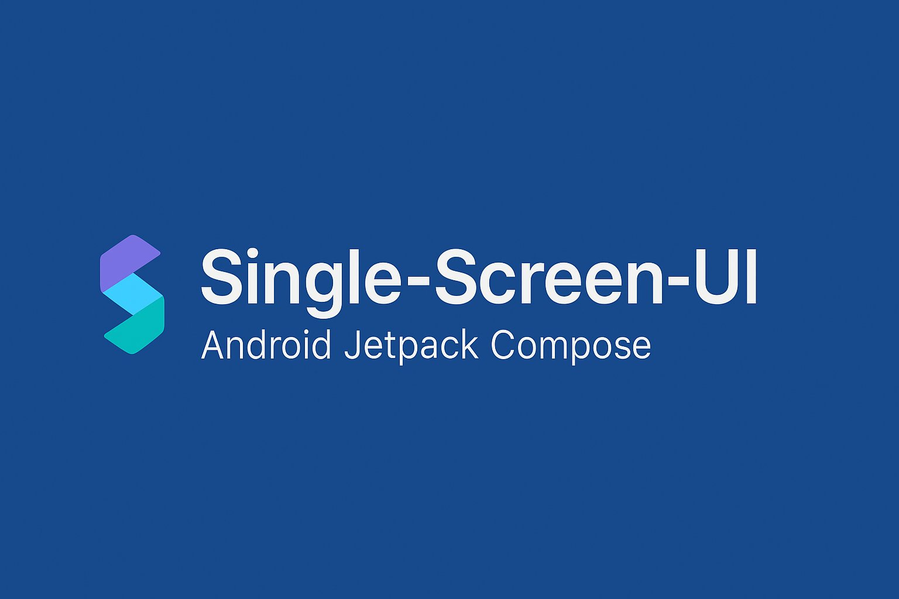

# Single-Screen-UI

**Single-Screen-UI** is an open-source Android project built using **Jetpack Compose**, designed to provide clean, reusable, and modern single-screen UI templates for developers. It demonstrates best practices for building a single-screen user interface on Android. This project aims to accelerate UI development and encourage collaboration by offering ready-to-use screen layouts following Material Design principles.

## 🚀 Features

- 📱 Single-screen UI components built with Jetpack Compose
- 🎨 Beautiful, modular, Clean and maintainable architecture following best practices.
- 🧩 Easy to plug into any Compose-based project
- 🌍 Open for contributions from the developer community


## 🛠️ Tech Stack

- **Language**: Kotlin
- **UI Framework**: Jetpack Compose
- **Tools**: Android Studio, Material3 Theme

## ✨ Getting Started

To get started with **Single-Screen-UI**, follow these steps:

### Prerequisites

Ensure you have the following tools installed:

- Android Studio (latest version)
- Kotlin (latest stable version)
- Jetpack Compose (make sure it’s enabled in your project)

### Software Requirements Specification

Here is my software requirements specification.

| Software | Version                      |
|----------|------------------------------|
| Java Jdk | `17-Jbr` (JetBrains runtime) |
| AGP      | `8.5.2`                      |
| Gradle   | `8.7`                        |

## 📦 Installation

Clone the repository:

```bash
git clone https://github.com/PremDanej/Single-Screen-UI.git
```

## 🖼️ Screenshots

|                   SignInScreen(Day)                   | SignInScreen(Night)                                    |
|-----------------------------------------------|--------------------------------------------------|
|  |  |

## 🤝 Contributing

We welcome contributions from developers around the world! If you have an idea for a new screen, bug fix, or enhancement:

1. Fork the repository from `master`

2. Change a branch `git checkout developer`

3. Commit your changes
    - For new screen - `git commit -m 'Add new screen'`
    - For fixing a bug - `git commit -m 'Bug fixed of this {ScreenName}'`

4. Push to the branch

5. Create a Pull Request

Make sure your contributions follow [Conventional Commits](https://www.conventionalcommits.org/en/v1.0.0/) for consistency.

## 📬 Contact

For questions or suggestions, feel free to open an issue or reach out for Discussions:

| Github                                                                           | In                                                                                             | Ig                                                                                           | X                                                                                |
|----------------------------------------------------------------------------------|------------------------------------------------------------------------------------------------|----------------------------------------------------------------------------------------------|----------------------------------------------------------------------------------|
| [](https://github.com/PremDanej) | [](https://www.linkedin.com/in/prem-danej) | [](https://www.instagram.com/prem_dnj) | [](https://www.x.com/prem_dnj) |

## 📄 License

This project is licensed under the [MIT License](LICENSE.md).